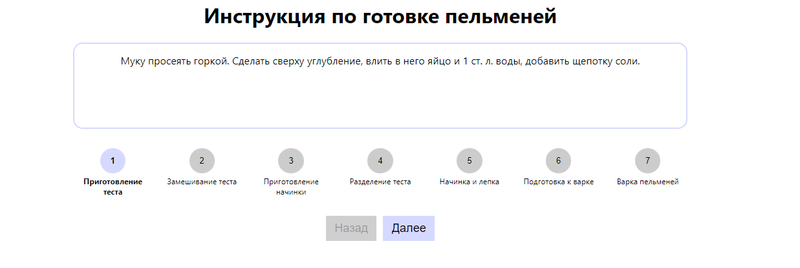

# Homework Components 2



## Описание

Этот проект представляет собой пошаговую инструкцию по приготовлению пельменей. Приложение помогает пользователю пройти все этапы приготовления пельменей, начиная с приготовления теста и заканчивая варкой.

### Основные функции:
- Каждый шаг сопровождается подробным описанием действий, которые необходимо выполнить.
- Интерфейс позволяет двигаться по шагам с помощью кнопок **"Назад"** и **"Далее"**, что позволяет пользователю не пропустить ни один этап.
- Текущий шаг подсвечивается, что упрощает навигацию по процессу готовки.

## Использование

Приложение доступно онлайн по следующей ссылке на GitHub Pages:

[Homework Components 2 - GitHub Pages](https://blinklay.github.io/homework-components-2/)

## Установка и запуск

Для локального запуска приложения выполните следующие шаги:

1. Клонируйте репозиторий:

    ```bash
    git clone https://github.com/blinklay/homework-components-2.git
    ```

2. Перейдите в директорию проекта:

    ```bash
    cd homework-components-2
    ```

3. Установите зависимости:

    ```bash
    npm install
    ```

4. Запустите приложение:

    ```bash
    npm run dev
    ```

После этого приложение будет доступно по адресу `http://localhost:3000`.

## Скриншоты


